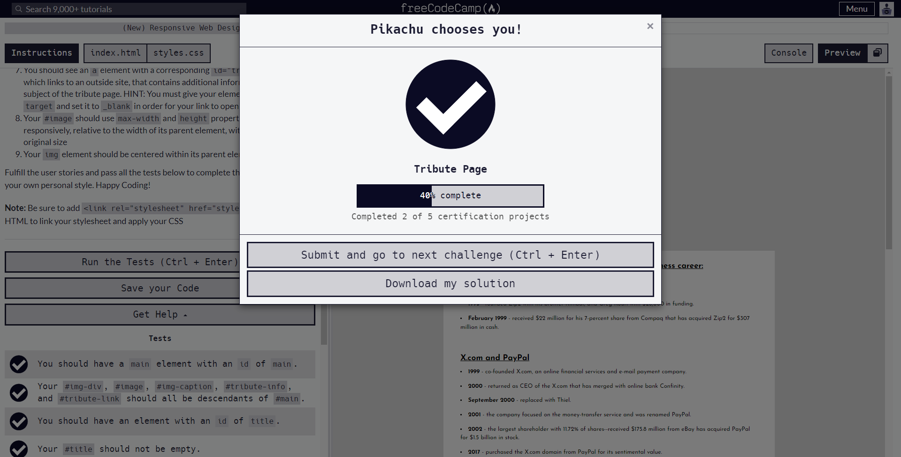
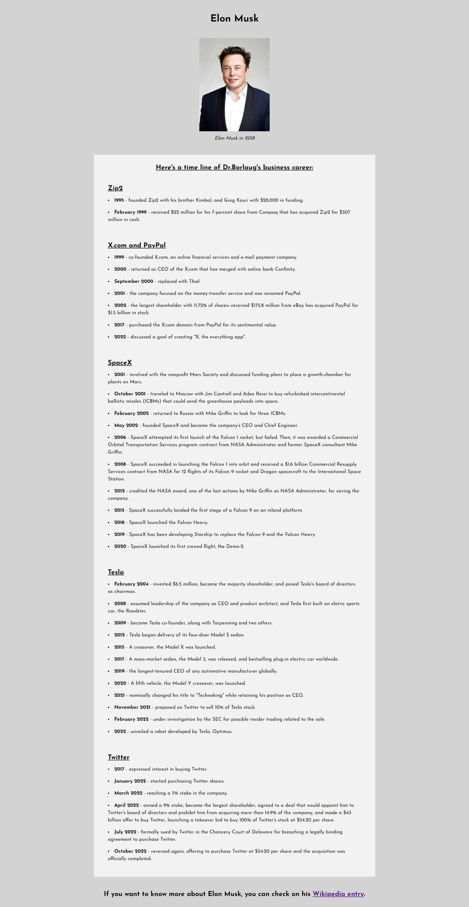

# freeCodeCamp - Build a Tribute Page

This is my solution for the [freeCodeCamp Responsive Web Design Certification Project Tribute Page](https://www.freecodecamp.org/).

## Table of Contents

- [Overview](#overview)
    - [Screenshot](#screenshot)
    - [Links](#links)
- [My Process](#my-process)
    - [Built with](#built-with)
- [Author](#author)

## Overview

### Screenshot

**Desktop**

**Tablet**

**Mobile**

### Links

- Live Site URL: [Responsive Web Design Certification Project Tribute Page](https://dwz-wong.github.io/freeCodeCamp-tribute-page)

## My Process

### Built with

- HTML
- CSS

## Author

- freeCodeCamp - [@dwz_wong](https://www.freecodecamp.org/dwz_wong)
- Frontend Mentor - [@dwz-wong](https://www.frontendmentor.io/profile/dwz-wong)
- Twitter - [@dwz_wong](https://twitter.com/dwz_wong)
